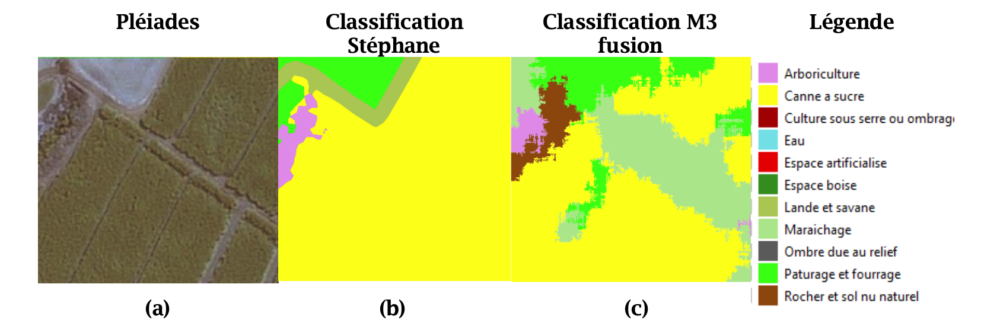

# Classify_Pleiades_DeepLearning #
*Repository with code from a 5 months internship.* 

### Context ###
This internship is part of the PostDoc project led by Christophe Lin-Kwong-Chon :"DEEP LEARNING FOR REUNION ENERGY AUTONOMY" (DEEPRUN). 
This project, in partnership with the University of Reunion and the CIRAD, is about the optimization of the production potential of renewable energies in Reunion Island: photovoltaic and biomass.
To do this, the project is based on both satellite images (identification of biomass sources) and reversible fuel cell images acquired by a high-speed camera (energy storage via the hydrogen vector). To summarize, these are techniques for determining certain characteristics of observed points from remote measurements. In this project, one of the aspects is related to my internship subject. It consists in exploiting satellite images, classifying them, and producing a map of
land use.
The advantages of **remote sensing** are essentially linked to the reasonable cost of the knowledge it produces. Indeed, this method allows to reach areas difficult to access, large surfaces and allows a follow-up of the observations in time. The objective is
then to obtain a map of the land use of the island of Reunion.
In order to exploit these satellite images, the project aims to determine the potential of a technology at the heart of scientific news: **Deep Learning**, to identify the occupation land use.
The Deep Learning approach is promising because, in addition to the fact that human intervention is not necessary, it is also a methodology that has proven its effectiveness in massive amounts of data.
The main objective of this internship is to study the performance of different deep learning methods in order to produce a tool for fine-grained recognition of Réunionese cultures. 
\
Finally, obtaining land use maps allows various applications. Thanks to these, we can study the impact of agricultural activities, list them, and estimate the production of crops.
Within the framework of the project, land monitoring would also allow the monitoring of carbon stocks, biomass production (wood, sugar cane, etc.) and its spatial distribution in order to to produce renewable energy.

\
The steps of this internship are:

- To carry out a bibliographic analysis of deep learning methods used in spatial remote sensing;
- To propose a method for implementing some of the most promising algorithms; -To build the learning base;
- Evaluate the performance of these algorithms on test areas.

### What we wish to achieve ###
Currently, land cover maps are based on satellite image processing techniques using remote sensing expertise and classifiers. This is the case for the Moringa chain (Dupuy et al., 2019). The methodology consists of using a very high resolution image (VHRS) as well as high resolution time series (HSR) in an approach combining object classification and the Random Forest algorithm (Dupuy, 2019; Leo Breiman, 2001). In order to determine the potential of Deep
Learning methods for land use, we take as a reference the work of Stéphane Dupuy (Dupuy et al., 2019) who currently provides land use maps from the Moringa processing chain.

### Creation_Dataset ###

Input data :
- A Pleiades 4-band image:
The image is in GeoTiff format of approximately 130GB. The GeoTIFF format allows adding georeferencing information to a TIFF (Tagged Image File Format) image.
- Ground truth in shape format:
Polygons delineating labeled homogeneous areas of occupation.. There are three levels of classification more or less detailed on figure 6 . The ground truth polygons have an attribute table with three different levels of classification
Most of the work has been done on level 3 of classification.

We used the free software of management of Geographic Information System (GIS) **Qgis**. The first step is to define an adapted processing chain for the creation of the database. The objective is to create a learning database using a simple and reusable algorithm. The deliverable is therefore the algorithm itself with a document summarizing the methodology.(Annexe 1) 
The work on Qgis allows to create a mask of all the thumbnails: a right-of-way to cut the Pleiades image. 
Then, it was necessary to write a code on Python using the GDAL libraries to cut the satellite image according to the mask. The script then allows to obtain :
- Subfolders containing 1000 thumbnails each. Each thumbnail in Tiff format has an arbitrary name.
- A file in CVS (comma-separated values) format presenting the path of the thumbnails, their class (a number between 0 and 30 for example for level 3) and their label (the class in text).

### Main_Metrics ###

I worked on the Intel® bi- Xeon® Gold 6240 CPU @2.60GHz with an NVIDIA Quadro RTX 4000, all in VPN access
I implemented the algorithms of the two CNN models on Python. Python was chosen as the language for its simplicity, efficiency and availability of the online community. Indeed, we decided to work on the free and open source distribution Anaconda and through the web interface JupterLab. A first notebook was dedicated to the code allowing the creation of the database. The second notebook, supported in the section below, deals with the implementation of theneural network.

The skeleton of my code and the structure of the data were left to my own choice.

I was inspired by a code that participated to a Kaggle contest,available on the internet. Indeed an article written by Jason Brownlee on May 20th 2019 presents an interesting structure to classify the satellite images of the database: "Planet". I have thus used this structure for the skeleton of my code.

The notebook itself is divided into several parts:

- Implementation of the Numpy, Keras, Tensorflow... libraries useful for Deep Learning ;
- Database management:
- Creation of a dictionary to store variables;
- Input images in TIFF format converted into Numpy 50x50x4 matrices forM3fusion or 227x227x4 for AlexNet coded on 8bits;
- The output vector is a One-hot encoded row vector (30 columns of 0, except for the column corresponding to the image class);
 -We then differentiate a batch of images and output vectors used for training representing 70% of the database. The remaining 30% are used for model validation.
- Definition of the CNN using convolution layers and other necessary layers using the Keras API in sequential mode;
- Training of the CNN: the training is done "from scratch". This choice was motivated by
This choice was motivated by the difference between the objects on which AlexNet was trained and the objects that we want to classify. For M3 fusion, we had the same approach because we only recovered a part of the recovered only a part of the model;
- The state of the art and the design of the database meant that we preferred to train the network from scratch.

The notebook is linked to Comet for hyper-parameters optimization. 

### Classification ###
The principle is simple: it is to make a prediction on a patch of size 50x50 pixels for M3 fusion. 
This patch browse the input image and predict a class. This class will then be reported in a classification matrix. For each patch,
we classify the central pixel.
To counter the edge effects and classify the pixels at the edge of the image, we add a padding. The padding chosen is the padding "mirror" size 25x25. This will reflect the values at the edge. To illustrate what padding is, here is an example:
 
Let's take the matrix A = [1, 2, 3, 4, 5].
 A padding of size 2 will give : A'= [3, 2, 1, 2, 3, 4, 5, 4, 3]
The classification matrix is the same size as the input satellite image.

### Results ###

Figure a is mostly composed of sugarcane.
The classification produced by the TETIS unit (figure b) is an object-oriented classification. We observe mainly sugar cane and the edge of the crops represented by the class "heath and savanna".
While the classification produced in the framework of this training course (figure 15.c) is a pixel approach. This classification is obtained with the methodology described above, in addition to the application of a sieve filter.
We observe that on figure c there are several objects. We can discern mainly sugar cane, market gardening and pasture. This classification is more accurate overall because each pixel is assigned a class, but it performs less well because the edges of the fields are assigned the class: "Maraichage".

### Bibliography ###
Anon. s. d. « Planet: Understanding the Amazon from Space | Kaggle ». Consulté 5 août 2021a (https://www.kaggle.com/c/planet-understanding-the-amazon-from-space/overview).

\
Basu, Saikat, Sangram Ganguly, Supratik Mukhopadhyay, Robert DiBiano, Manohar Karki, et Ramakrishna Nemani. 2015. « DeepSat: A Learning Framework for Satellite Imagery ». Proceedings of the 23rd SIGSPATIAL International Conference on Advances in Geographic Information Systems 1-10. doi: 10.1145/2820783.2820816.

\
Benedetti, P., D. Ienco, R. Gaetano, K. Osé, R. Pensa, et S. Dupuy. 2018. « M3Fusion: A Deep Learning Architecture for Multi-{Scale/Modal/Temporal} Satellite Data Fusion ». ArXiv:1803.01945 [Cs].

\
Breiman, Leo. 2001. « Random Forest ». Machine Learning 45(1):5-32. doi: 10.1023/A:1010933404324.

\
Brownlee, Jason. 2019. « Multi-Label Classification of Satellite Photos of the Amazon Rainforest ». Consulté 15 avril 2021 (https://machinelearningmastery.com/how-to-develop-a- convolutional-neural-network-to-classify-satellite-photos-of-the-amazon-rainforest/).
Centre canadien de télédétection, éd. 2019. « Notions fondamentales de télédétection ».

\
Cheng, Gong, Junwei Han, et Xiaoqiang Lu. 2017. « Remote Sensing Image Scene Classification: Benchmark and State of the Art ». Proceedings of the IEEE 105(10):1865-83. doi: 10.1109/JPROC.2017.2675998.

\
Cheng, Gong, Xingxing Xie, Junwei Han, Lei Guo, et Gui-Song Xia. 2020. « Remote Sensing Image Scene Classification Meets Deep Learning: Challenges, Methods, Benchmarks, and Opportunities ». IEEE Journal of Selected Topics in Applied Earth Observations and Remote Sensing 13:3735-56. doi: 10.1109/JSTARS.2020.3005403.
CIRAD. s. d. « Organigramme de l’UR Aïda ». Consulté 28 juillet 2021 (https://ur-aida.cirad.fr/l- unite/organisation).

\
Dupuy, Stéphane, Laurence Defrise, Valentine Lebourgeois, Lionel Le Mézo, et Raffaele Gaetano. s. d. « Moringa pour cartographier l’occupation du sol à la Réunion et Antananarivo ». 

\
Hinton, Geoffrey E., Nitish Srivastava, Alex Krizhevsky, Ilya Sutskever, et Ruslan R. Salakhutdinov. 2012. « Improving Neural Networks by Preventing Co-Adaptation of Feature Detectors ». ArXiv:1207.0580 [Cs].

\
Krizhevsky, Alex, Ilya Sutskever, et Geoffrey E. Hinton. 2017. « ImageNet Classification with Deep Convolutional Neural Networks ». Communications of the ACM 60(6):84-90. doi: 10.1145/3065386.

\
Rice, Leslie, Eric Wong, et J. Zico Kolter. 2020. « Overfitting in Adversarially Robust Deep Learning ». ArXiv:2002.11569 [Cs, Stat].

\
Russakovsky, Olga, Jia Deng, Hao Su, Jonathan Krause, Sanjeev Satheesh, Sean Ma, Zhiheng Huang, Andrej Karpathy, Aditya Khosla, Michael Bernstein, Alexander C. Berg, et Li Fei-Fei. 2015. « ImageNet Large Scale Visual Recognition Challenge ». ArXiv:1409.0575 [Cs].

\
Srivastava, Nitish, Geoffrey Hinton, Alex Krizhevsky, Ilya Sutskever, et Ruslan Salakhutdinov. s. d. « Dropout: A Simple Way to Prevent Neural Networks from Overfitting ». 

\
Xia, Gui-Song, Jingwen Hu, Fan Hu, Baoguang Shi, Xiang Bai, Yanfei Zhong, Liangpei Zhang, et Xiaoqiang Lu. 2017. « AID: A Benchmark Data Set for Performance Evaluation of Aerial Scene Classification ». IEEE Transactions on Geoscience and Remote Sensing 55(7):3965-81. doi: 10.1109/TGRS.2017.2685945.

\
Zhang, Chiyuan, Samy Bengio, Moritz Hardt, Benjamin Recht, et Oriol Vinyals. 2017.
« Understanding Deep Learning Requires Rethinking Generalization ». ArXiv:1611.03530 [Cs].
